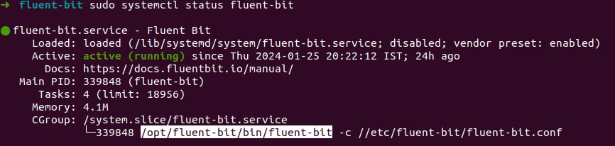

## What is Fluent Bit

> Official defenition
>
> Fluent Bit is a lightweight open-source telemetry agent specifically designed to efficiently handle the challenges of collecting and processing telemetry data across a wide range of environments, from constrained systems to complex cloud infrastructures. 

**Whoops...** Let me simplify that definition.

Fluent Bit is lightweight Log Processor gathers information from various sources, utilizes Parsers and Filters to process the collected data, and then sends the processed information to mutliple storages. 

![[images/image.png]]


I am using Ubuntu. I will cover how to do same using docker image in future.

```bash
curl https://raw.githubusercontent.com/fluent/fluent-bit/master/install.sh | sh
```

and run below command to start

```
sudo systemctl start fluent-bit
sudo systemctl status fluent-bit 
```




